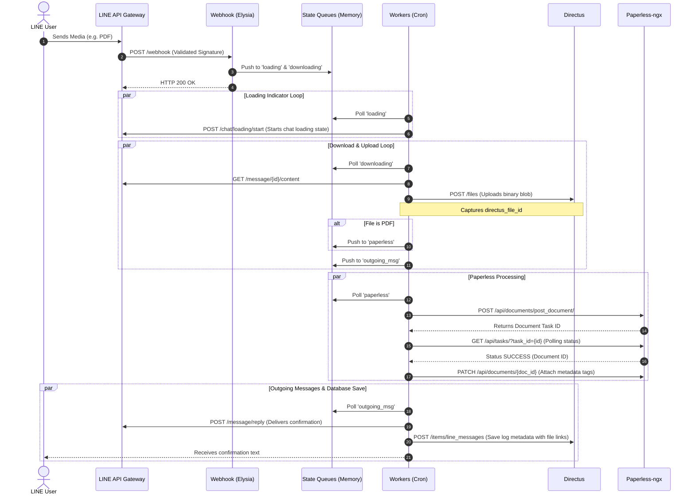

# PROJECT.md: LINE Bot Filestore Architecture & Specifications

This document serves as the single source of truth for the LINE Bot Filestore repository, detailing the technology stack, module architecture, database design, local setup guide, and architectural gap analysis.

---

## 1. Executive Summary
The **LINE Bot Filestore** is a highly automated media and document ingestion gateway designed to run as a LINE messaging bot. It acts as a bridge between the popular LINE messaging platform and enterprise self-hosted document management/database systems.

### Key Objectives
* **Seamless Ingestion**: Accept user-submitted documents (PDFs), images, videos, audio clips, and text messages directly through a chat interface.
* **Automated Archiving**: Automatically upload and index PDFs into a self-hosted **Paperless-ngx** document management instance.
* **Centralized Data Storage**: Upload media files and metadata records directly into a local **Directus** instance for unified data discovery and indexing.
* **User Feedback Loop**: Keep the end-user updated on the processing and storage status of their submitted assets via real-time LINE replies.

### Target Audience
* **Self-hosted Enthusiasts & Small Teams**: Users looking to easily capture documents (receipts, contracts) and media on the go directly from their smartphones, without accessing complex web dashboards.
* **Archivists**: Professionals seeking a friction-free gateway to direct mobile-to-archive workflows.

---

## 2. Tech Stack

The exact technology stack identified from project configuration files (`package.json`, `tsconfig.json`, `Dockerfile`):

### Core Runtime & Frameworks
* **Runtime**: [Bun v1.x](https://bun.sh/) (alpine-based Docker base image `oven/bun:1-alpine`).
* **Web Framework**: [ElysiaJS v1.3.4](https://elysiajs.com/) (fast, type-safe router designed for Bun).
* **Worker Scheduler**: `@elysiajs/cron v1.3.0` (executes background queue tasks).
* **Logging**: `logestic v1.2.4` (handles HTTP access logging).
* **JWT Helper**: `@elysiajs/jwt v1.3.1` (available in packages for signature/token security).

### External Core Systems
* **Headless CMS & File Hub**: **Directus (v11+ API compatible)**
  * SDK Dependency: `@directus/sdk v22.0.0`
  * Role: Relational engine, file storage manager, and search gateway.
* **Document Management System (DMS)**: **Paperless-ngx** (API-based ingestion for OCR parsing and sorting).
* **Platform API**: **LINE Messaging API v2** (Webhook endpoint and reply delivery).

### Database & Storage Recommendations
* **Production Database**: PostgreSQL (runs underneath the local Directus instance).
* **Development Database**: SQLite or PostgreSQL.
* **File Storage**: Local directory storage (fallback/backup via `FILESTORE_PATH`) and Directus local/S3 storage drivers.

---

## 3. System Architecture & Component Flows

The app implements a decoupled queue architecture using Elysia's global in-memory state as volatile FIFO queues.



---

## 4. Functional Breakdown of Modules

* **`src/index.ts`**: Webhook endpoint receiver. Performs HMAC-SHA256 signature verification on the request body using `CHANNEL_SECRET`, checks against allowed user IDs, and pushes message structures onto the appropriate memory queue.
* **`src/state.ts`**: Declares Elysia global state arrays (`downloading`, `loading`, `outgoing_msg`, `paperless`, `transcoding`) which serve as volatile task queues.
* **`src/types.ts`**: Defines TypeBox runtime validation models for LINE webhook schemas and specifies static TypeScript structures (`OutgoingMsgType`, `MsgEventType`).
* **`src/directus.ts`**: Exports an initialized Directus client using the `@directus/sdk` configured for static token authorization.
* **`src/workers/loading.ts`**: Emits the LINE chat loading state so the sender sees typing/processing cues.
* **`src/workers/transcoding.ts`**: Checks LINE video/audio transcoding state machine for succeed/retry.
* **`src/workers/downloading.ts`**: Fetches files from LINE's media servers, uploads to Directus, and routes PDFs to the Paperless queue.
* **`src/workers/paperless.ts`**: Uploads PDF buffers to Paperless-ngx, polls task resolution, and logs reporter tags.
* **`src/workers/outgoing.ts`**: Replies to the user via LINE and creates metadata records in the Directus `line_messages` collection. Also writes files locally to `FILESTORE_PATH` if configured.
* **`scripts/migrate_to_directus.py`**: A python script that reads existing local `.meta.json` records, uploads matching files to Directus, creates the `line_messages` records, preserves the original files, and logs everything to a CSV file.

---

## 5. Directory Structure Blueprint

```
line-filestore/
├── .env                              # Active environment configuration (gitignored)
├── .gitignore                        # Git exclusion file
├── Dockerfile                        # Multi-stage production alpine-bun container definition
├── PROJECT.md                        # Architecture design doc (This file)
├── README.md                         # Project description & basic run instructions
├── bun.lock                          # Bun package dependency lockfile
├── docker-compose.yaml               # Docker Compose file orchestrating services
├── package.json                      # Package scripts & dependencies
├── tsconfig.json                     # TypeScript settings for Elysia and Bun
├── line-filestore.service            # Systemd unit file for host-level daemon deployments
├── scripts/
│   └── migrate_to_directus.py        # Standalone Python data migration script
└── src/
    ├── index.ts                      # Webhook listener and queue ingestion hub
    ├── directus.ts                   # Directus client configuration
    ├── state.ts                      # State definitions for volatile in-memory queues
    ├── types.ts                      # Webhook schema definitions & types
    └── workers/
        ├── index.ts                  # Worker modules bundle exporter
        ├── downloading.ts            # Media download and Directus upload cron task
        ├── loading.ts                # Sender loading indicator trigger cron task
        ├── outgoing.ts               # LINE reply & Directus database insert cron task
        ├── paperless.ts              # Paperless-ngx ingestion and metadata indexing cron task
        └── transcoding.ts            # Audio/video transcoding check cron task
```

---

## 6. Steps to Spin Up Local Development Environment

### Prerequisite Configuration
Create a `.env` file in the root directory by copying `sample.env` and filling in the credentials:
```env
ACCESS_TOKEN="<LINE bot access token>"
CHANNEL_SECRET="<LINE bot channel secret>"
ALLOW_USER_IDS="<List of allowed user IDs, comma separated>"
FILESTORE_PATH="/path/to/local/backup/folder"

# Paperless Settings
PAPERLESS_URL="http://localhost:8000"
PAPERLESS_API_AUTH_TOKEN="<Paperless token>"
PAPERLESS_CORRESPONDENT=1
PAPERLESS_STORAGE_PATH=2
PAPERLESS_TAGS=3

# Directus Settings
DIRECTUS_HOST="http://localhost:8055"
DIRECTUS_TOKEN="<Directus static token>"
```

### Step 1: Install Dependencies
Run the following command using Bun:
```bash
bun install
```

### Step 2: Set Up Directus Collection
Ensure your local Directus instance is running and create a collection named `line_messages`.
* Add `message_id` (String, Indexed)
* Add `destination` (String)
* Add `sender_id` (String)
* Add `message_type` (String)
* Add `text_content` (Text)
* Add `timestamp` (Datetime, Indexed)
* Add `timestamp_raw` (BigInt)
* Add `file` (Many-to-One relationship to `directus_files`)
* Add `file_preview` (Many-to-One relationship to `directus_files`)
* Add `payload` (JSON)

### Step 3: Run the Server
Launch the development server with live watch reload:
```bash
bun run dev
```

### Step 4: Expose Local Port for Webhooks
To test live LINE webhooks, use a secure tunnel (e.g. Cloudflare Tunnels, `ngrok`, or `localtunnel`) to route LINE traffic to your local server:
```bash
ngrok http 3000
```
Update your LINE webhook endpoint URL in the LINE Developers Console to: `https://your-tunnel-subdomain.ngrok-free.app/webhook`.

---

## 7. Architectural Gaps & Environment Enhancements

### 1. Missing Directus Variables in Docker Compose
The `docker-compose.yaml` currently runs the `filestore` service, but is missing the environment definitions for Directus connection credentials. If deployed via Compose in its current state, the containerized application will fail to write data to Directus.
**Fix**: Add the following to the `environment` block in `docker-compose.yaml`:
```yaml
      DIRECTUS_HOST: ${DIRECTUS_HOST}
      DIRECTUS_TOKEN: ${DIRECTUS_TOKEN}
```

### 2. Missing Directus Variables in Systemd Service
The `line-filestore.service` unit file starts the app via Bun, but does not configure environment variable injection.
**Fix**: Ensure your systemd file references an environment file:
```ini
[Service]
...
EnvironmentFile=/var/www/app-linebot-filestore/.env
```

### 3. Queue Volatility
The state queues in `src/state.ts` are stored in memory. If the server crashes or restarts mid-queue processing, queued downloads, paperless actions, or pending LINE replies will be permanently lost.
**Mitigation**: For a production deployment, replace the array-backed `statePlugin` with a persistent broker (like RabbitMQ or Redis) or a light persistent embedded DB (like SQLite).
