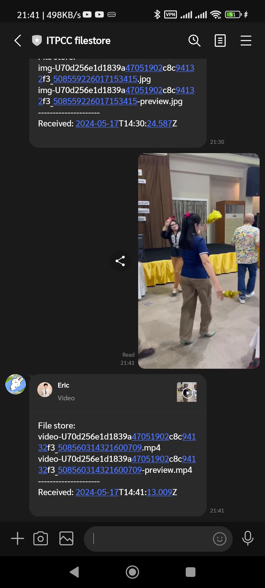

# LINE Filestore: LINE bot for storing file

Mainly for replacement of [deprecated LINE Keep service](https://www.blognone.com/node/139545).

Based on [Elysia](https://elysiajs.com/?uwu=true) and [Bun](https://bun.sh).

## Install

0. Install [Bun](https://bun.sh/docs/installation)
1. `bun update`
2. Create [LINE official account](https://developers.line.biz/en/docs/messaging-api/overview/)
3. Create folder to install. You may also use
   [`rclone mount`](https://rclone.org/commands/rclone_mount/) to mount external storage service.
4. Copy [`sample.env`](./sample.env) to `.env` and config accordingly.
5. `bun run src/index.ts`
6. If you want to run permanently with `systemd`, you may use
   [config file](./line-filestore.service) to do so by follow
   [tutorial by Bun](https://bun.sh/guides/ecosystem/systemd).
