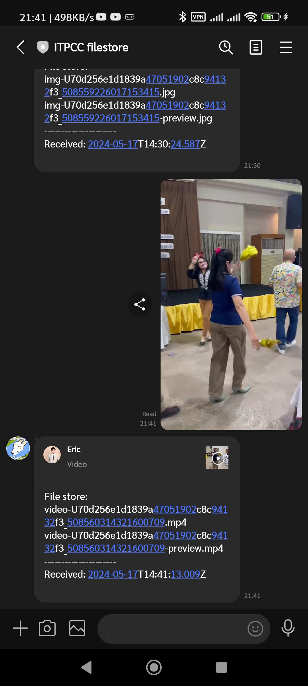

# LINE Filestore: LINE bot for storing file

Mainly for replacement of [deprecated LINE Keep service](https://www.blognone.com/node/139545).

Based on [Elysia](https://elysiajs.com/?uwu=true) and [Bun](https://bun.sh).

## Install

0. Install [Bun](https://bun.sh/docs/installation)
1. `bun update`
2. Create [LINE official account](https://developers.line.biz/en/docs/messaging-api/overview/)
3. Create folder to install. You may also use
   [`rclone mount`](https://rclone.org/commands/rclone_mount/) to mount external storage service.
4. Copy [`sample.env`](./sample.env) to `.env` and config accordingly.
5. `bun run src/index.ts`
6. If you want to run permanently with `systemd`, you may use
   [config file](./line-filestore.service) to do so by follow
   [tutorial by Bun](https://bun.sh/guides/ecosystem/systemd).

## Enabling Google Drive Service

To automatically download files from Google Drive links received in text messages:

1. **Set up Google Cloud Credentials**:
   - Create a project in the [Google Cloud Console](https://console.cloud.google.com/).
   - Enable the **Google Drive API**.
   - **Option 1: Personal Account (Download on your behalf)**:
     1. Go to **Credentials** -> **Create Credentials** -> **OAuth client ID** (Application type: *Desktop App*).
     2. Copy your **Client ID** and **Client Secret**.
     3. Obtain a **Refresh Token** for your personal Google account (e.g. using [Google OAuth 2.0 Playground](https://developers.google.com/oauthplayground) with scope `https://www.googleapis.com/auth/drive.readonly`, or `rclone authorize "drive"`).
   - **Option 2: Service Account**: Create a **Service Account**, download the JSON key file, and share target Drive files with the service account email.
   - **Option 3: API Key**: Create an **API Key** (for public files only).

2. **Configure Environment Variables (`.env`)**:
   - `GDRIVE_FILE_SIZE_MAX_MB`: Maximum allowed file size in MB to download (e.g. `50`).
   - **For Personal Account**:
     - `GDRIVE_OAUTH_CLIENT_ID`: Your OAuth 2.0 Client ID.
     - `GDRIVE_OAUTH_CLIENT_SECRET`: Your OAuth 2.0 Client Secret.
     - `GDRIVE_OAUTH_REFRESH_TOKEN`: Your OAuth 2.0 Refresh Token.
   - **For Service Account / API Key**:
     - `GDRIVE_SERVICE_ACCOUNT_JSON`: Path to service account JSON key file or raw JSON string.
     - `GDRIVE_API_KEY`: Google Drive API Key.

3. **Usage**:
   - Send any text message containing a Google Drive link (e.g., `https://drive.google.com/file/d/FILE_ID/view`) to the LINE bot.
   - If accessible and within `GDRIVE_FILE_SIZE_MAX_MB`, the file will be downloaded, saved to the local filestore, and uploaded to Directus.

